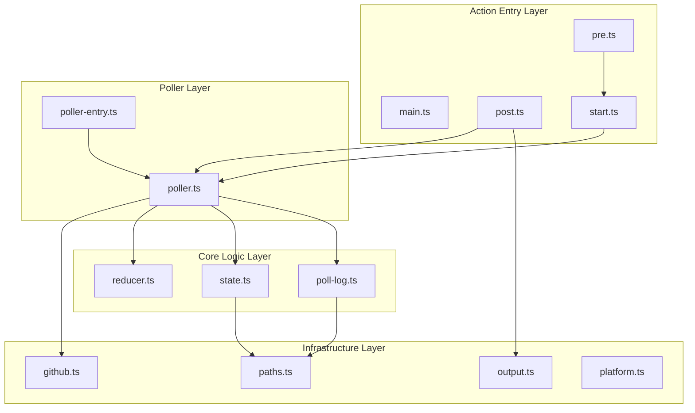

# github-api-usage-monitor v2 - Specification

> **This document is derived from `spec/spec.v2.json`.** Do not edit directly; regenerate from the authoritative spec.

**Status:** implemented
**Canonical Date:** 2026-02-02
**Spec Version:** 2.0

---

## Summary

A GitHub Action that monitors API rate-limit usage during a job using pre/post hooks. A detached poller performs adaptive /rate_limit sampling, then the post hook renders a summary and can upload diagnostics artifacts (state.json + poll-log.json) when enabled.

---

## Scope Boundary

### In Scope

- Bucket-level accounting of primary rate-limit usage during a job (hour- and minute-buckets)
- Adaptive polling that targets reset boundaries with a debounce floor
- Single-step user experience via pre/post hooks (no explicit start/stop steps)
- Clear, actionable output: per-bucket totals, warnings, remaining quota, next reset time
- Optional diagnostics artifacts uploaded on post (state.json and poll-log.json) when enabled
- Linux/macOS GitHub-hosted runners

### Out of Scope

- Per-request endpoint tracing (URL/method)
- Per-step attribution
- Secondary rate-limit diagnostics (burstiness, concurrency, abuse heuristics)
- Strong guarantees on job cancellation/runner crash (partial results acceptable)
- Windows support
- Job-level container support
- Self-hosted runner and GHES support

---

## Steel Thread Acceptance Criteria

1. Pre hook spawns a background poller that persists across workflow steps
2. Poller uses adaptive scheduling (base interval 30s, debounce floor) and updates reducer state
3. Post hook terminates poller and produces summary in step summary + console
4. Post hook uploads diagnostics artifacts containing state.json and poll-log.json when diagnostics are enabled
5. Warnings are emitted for poll failures, anomalies, and unsupported environments
6. Token is never printed to logs

---

## Functional Requirements

| ID | Priority | Requirement | Notes |
|----|----------|-------------|-------|
| F1 | must | Pre hook validates platform and token, creates baseline state, and spawns detached poller | Initial /rate_limit poll establishes baseline and fails fast on invalid token |
| F2 | must | Post hook terminates poller and prints summary even if poller not running | Best-effort output; run with post-if: always() |
| F3 | must | Accept token input; default to github.token / GITHUB_TOKEN if present | Never print token; use GitHub masking |
| F4 | must | Poll /rate_limit using adaptive scheduling with a 30s base interval and a debounce floor | Targets pre-reset windows; burst polling near reset boundaries |
| F5 | must | Persist state and PID to $RUNNER_TEMP for cross-step access | state.json in $RUNNER_TEMP/github-api-usage-monitor; PID at poller.pid |
| F6 | must | Track all rate-limit buckets returned by /rate_limit API | Report all buckets with usage in summary |
| F7 | must | Handle reset boundaries by including used count immediately after reset change | Minimizes undercount; post-reset used reflects consumption since new window |
| F8 | must | Detect anomalies when used decreases without reset change | Increment anomaly counter; do not subtract from totals; emit warning |
| F9 | should | Periodically write state file for durability during long-running polls | Best-effort data preservation on unexpected termination |
| F10 | should | Output summary to GitHub step summary and console | Table sorted by total_used desc; one-line console summary + top buckets |
| F11 | should | When diagnostics are enabled, write per-poll JSONL diagnostics log to poll-log.jsonl | Best-effort; do not disrupt poller on write errors |
| F12 | must | When diagnostics are enabled, upload diagnostics artifacts in post hook | state.json and poll-log.json uploaded as a single artifact |
| F13 | should | Allow override of artifact name | Optional input for matrix jobs to avoid collisions |
| F14 | must | Allow diagnostics to be enabled or disabled via input | Default off; when disabled, skip poll log and artifact upload |

---

## Non-Functional Requirements

| ID | Category | Requirement | Measurement |
|----|----------|-------------|-------------|
| NF1 | security | No secrets in logs | Token never appears in stdout/stderr; no set -x; use GitHub masking |
| NF2 | reliability | Poller process survives step boundaries on Linux/macOS GitHub-hosted runners | Detached process with unref(); PID-based lifecycle management |
| NF3 | performance | Constant-space reducer with O(#buckets) per poll | State file remains small; minimal log volume |
| NF4 | maintainability | Deterministic reducer behavior with unit-testable pure functions | Table-driven tests for all reducer edge cases |
| NF5 | operational_safety | Poller has a maximum lifetime to prevent runaway processes | Exits after MAX_LIFETIME_MS with state write |

---

## Architecture

### Layer Diagram



### Layers

| Layer | Description |
|-------|-------------|
| **action** | GitHub Action entry points for pre/main/post hooks |
| **poller** | Background process that polls /rate_limit and updates state |
| **core** | Pure business logic for rate-limit reduction and state management |
| **infra** | External integrations and platform-specific code |

### Modules

| Module | Layer | Paths | Provided Ports |
|--------|-------|-------|----------------|
| pre | action | src/pre.ts | — |
| main | action | src/main.ts | — |
| post | action | src/post.ts | — |
| start | action | src/start.ts | start.monitor |
| poller | poller | src/poller.ts | poller.spawn, poller.kill |
| poller-entry | poller | src/poller-entry.ts | — |
| reducer | core | src/reducer.ts | reducer.update, reducer.initBucket |
| state | core | src/state.ts | state.read, state.write, state.writePid |
| poll-log | core | src/poll-log.ts | pollLog.append, pollLog.read |
| github | infra | src/github.ts | github.fetchRateLimit |
| output | infra | src/output.ts | output.render |
| paths | infra | src/paths.ts | paths.statePath, paths.pidPath, paths.pollLogPath |
| platform | infra | src/platform.ts | platform.isSupported, platform.detect, platform.assertSupported |

---

## Boundary Types

### ReducerState

Global reducer state persisted to state.json.

```typescript
interface ReducerState {
  buckets: Record<string, BucketState>;
  started_at_ts: string;        // ISO timestamp
  stopped_at_ts: string | null; // ISO timestamp
  poller_started_at_ts: string | null; // ISO timestamp
  interval_seconds: number;
  poll_count: number;
  poll_failures: number;
  last_error: string | null;
}
```

### BucketState

Per-bucket reducer state.

```typescript
interface BucketState {
  last_reset: number;      // epoch seconds
  last_used: number;
  total_used: number;
  windows_crossed: number;
  anomalies: number;
  last_seen_ts: string;    // ISO timestamp
  limit: number;
  remaining: number;
  first_used: number;
  first_remaining: number;
}
```

### RateLimitSample

Single sample from /rate_limit for one bucket.

```typescript
interface RateLimitSample {
  limit: number;
  used: number;
  remaining: number;
  reset: number;  // epoch seconds
}
```

### RateLimitResponse

Full response from GET /rate_limit.

```typescript
interface RateLimitResponse {
  resources: Record<string, RateLimitSample>;
  rate: RateLimitSample;  // deprecated alias for core
}
```

### SummaryData

Data passed to output renderer for summary generation.

```typescript
interface SummaryData {
  state: ReducerState;
  duration_seconds: number;
  warnings: string[];
}
```

### PollLogEntry

Diagnostic per-poll snapshot written to JSONL and uploaded as a JSON array.

```typescript
interface PollLogBucketSnapshot {
  used: number;
  remaining: number;
  reset: number;
  limit: number;
  delta: number;
  window_crossed: boolean;
  anomaly: boolean;
}

interface PollLogEntry {
  timestamp: string; // ISO
  poll_number: number;
  buckets: Record<string, PollLogBucketSnapshot>;
}
```

---

## Milestones

| ID | Name | Description | Exit Criteria |
|----|------|-------------|---------------|
| M1 | Core Logic | Implement reducer, state manager, and GitHub client | Reducer handles deltas, boundaries, anomalies; state atomic write; GitHub client parses response |
| M2 | Action Integration | Implement pre/post hooks and process lifecycle | Pre hook spawns poller; post hook stops poller and renders summary; platform detection; initial poll validates token |
| M3 | Testing | Unit tests and integration tests | Table-driven reducer tests; fixture-based parsing; serialized self-test workflow |
| M4 | Diagnostics | Poll log and artifact support | JSONL poll log when enabled; post hook uploads artifacts when enabled; downstream jobs can download diagnostics |
| M5 | Release | Build, bundle, and release automation | ncc bundle; CI/CD pipeline; action.yml references dist/*.js |

---

## Risks

| ID | Category | Risk | Mitigation |
|----|----------|------|------------|
| R1 | process | Orphan process if post hook does not run on job cancel | Acceptable; runner teardown kills process |
| R2 | process | PID not found or stale at stop time | Handle gracefully; emit warning; proceed with available state |
| R3 | platform | Background process behavior differs across runner types | Scope to GitHub-hosted Linux/macOS |
| R4 | platform | Windows process model differences | Fail-fast with clear message |
| R5 | api | /rate_limit transient failures | Count failures; show warning; no retry in v2 |
| R6 | api | Secondary rate limit if polled too aggressively | Adaptive schedule with debounce floor |
| R7 | correctness | Reset boundary between polls | Burst polls near reset to reduce undercount |
| R8 | correctness | Token context changes mid-job | Record anomaly; do not subtract; warn |
| R9 | diagnostics | Artifact upload failure hides diagnostics when enabled | Warn but still render summary; continue best-effort |

---

## File Structure

```
.
├── action.yml
├── package.json
├── tsconfig.json
├── src/
│   ├── pre.ts
│   ├── main.ts
│   ├── post.ts
│   ├── start.ts
│   ├── poller.ts
│   ├── poller-entry.ts
│   ├── github.ts
│   ├── reducer.ts
│   ├── state.ts
│   ├── poll-log.ts
│   ├── output.ts
│   ├── paths.ts
│   └── platform.ts
├── scripts/
│   ├── generate-self-test.ts
│   ├── self-test-manifest.json
│   ├── run-scenario.mjs
│   ├── validate-scenario.mjs
│   ├── check-scenario-enabled.mjs
│   └── render-diagnostics.mjs
├── .github/
│   └── workflows/
│       ├── self-test.yml
│       └── realistic-test.yml
├── spec/
│   ├── spec.json
│   └── spec.v2.json
└── docs/
    └── mapping_report.md
```

---

*Generated from spec/spec.v2.json*
