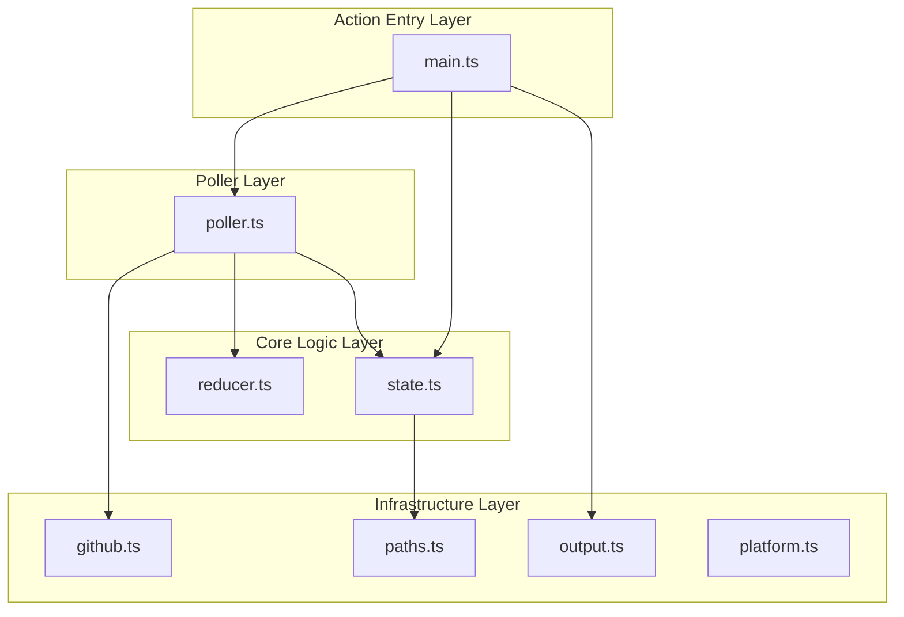

# github-api-usage-monitor v1 — Specification (Legacy)

> **This document is derived from `spec/spec.json` (legacy).** The authoritative spec is `spec/spec.v2.json` / `SPEC-v2.md`.

**Status:** ready_for_implementation
**Canonical Date:** 2026-01-25
**Spec Version:** 1.0

---

## Summary

A GitHub Action that polls the /rate_limit endpoint at a fixed interval during a job, maintaining a constant-space aggregator to estimate primary rate-limit consumption by bucket. Replaces snapshot-diff approach with a job-long monitor for reliable, bucket-level API usage accounting.

---

## Scope Boundary

### In Scope

- Reliable bucket-level accounting of primary rate-limit usage during a job (hour- and minute-buckets)
- Correctness across reset boundaries (fixed-duration windows anchored at first use per bucket)
- Minimal user friction: two workflow steps (start, stop) with sane defaults
- Clear, actionable output: per-bucket totals, warnings, remaining quota, next reset time
- Safe by design: no token leakage in logs, conservative polling cadence
- Linux/macOS GitHub-hosted runners

### Out of Scope

- Per-request endpoint tracing (URL/method)
- Per-step attribution
- Secondary rate-limit diagnostics (burstiness, concurrency, abuse heuristics)
- Strong guarantees on job cancellation/runner crash (partial results acceptable)
- Windows support
- Job-level container support
- Self-hosted runner support

---

## Steel Thread Acceptance Criteria

1. mode=start spawns a background poller that persists across workflow steps
2. Poller polls /rate_limit every 30 seconds and updates constant-space reducer state
3. mode=stop terminates poller and produces summary in step summary + console
4. Summary shows per-bucket usage totals, windows crossed, remaining quota, reset times
5. Warnings are emitted for poll failures, anomalies, and unsupported environments
6. Token is never printed to logs

---

## Functional Requirements

| ID | Priority | Requirement | Notes |
|----|----------|-------------|-------|
| F1 | must | Start mode spawns poller and returns success if started | Validates environment (Linux/macOS) before spawning |
| F2 | must | Stop mode terminates poller and prints summary even if poller not running | Best-effort output; run with always() condition |
| F3 | must | Accept token input; default to github.token / GITHUB_TOKEN if present | Never print token; avoid shell debug that echoes headers |
| F4 | must | Poll /rate_limit at 30-second intervals | Immediate initial poll on startup for baseline + token validation |
| F5 | must | Persist state to $RUNNER_TEMP paths for cross-step access | State at $RUNNER_TEMP/github-api-usage-monitor/state.json; PID at poller.pid |
| F6 | must | Track all rate-limit buckets returned by /rate_limit API | User configures which buckets to report (v1: report all with usage) |
| F7 | must | Handle reset boundaries by including used count immediately after reset change | Minimizes undercount; post-reset used reflects consumption since new window |
| F8 | must | Detect anomalies when used decreases without reset change | Increment anomaly counter; do not subtract from totals; emit warning |
| F9 | should | Periodically write state file for durability during long-running polls | Best-effort data preservation on unexpected termination |
| F10 | should | Output summary to GitHub step summary ($GITHUB_STEP_SUMMARY) and console | Table sorted by total_used desc; one-line console summary + top 3 buckets |

---

## Non-Functional Requirements

| ID | Category | Requirement | Measurement |
|----|----------|-------------|-------------|
| NF1 | security | No secrets in logs | Token never appears in stdout/stderr; no set -x; use GitHub masking |
| NF2 | reliability | Poller process survives step boundaries on Linux/macOS GitHub-hosted runners | Detached process with unref(); PID-based lifecycle management |
| NF3 | performance | Constant-space reducer with O(#buckets) per poll | State file remains small; minimal log volume |
| NF4 | maintainability | Deterministic reducer behavior with unit-testable pure functions | Table-driven tests for all reducer edge cases |

---

## Architecture

### Layer Diagram



### Layers

| Layer | Description |
|-------|-------------|
| **action** | GitHub Action entry point dispatching start/stop modes |
| **poller** | Background process that polls /rate_limit and updates state |
| **core** | Pure business logic for rate-limit reduction and state management |
| **infra** | External integrations and platform-specific code |

### Modules

| Module | Layer | Paths | Provided Ports |
|--------|-------|-------|----------------|
| main | action | src/main.ts | — |
| poller | poller | src/poller.ts | poller.spawn, poller.kill |
| reducer | core | src/reducer.ts | reducer.update, reducer.initBucket |
| state | core | src/state.ts | state.read, state.write |
| github | infra | src/github.ts | github.fetchRateLimit |
| output | infra | src/output.ts | output.render |
| paths | infra | src/paths.ts | paths.statePath, paths.pidPath |
| platform | infra | src/platform.ts | platform.isSupported, platform.detect |

---

## Boundary Types

### ReducerState

Global reducer state persisted to state.json.

```typescript
interface ReducerState {
  buckets: Record<string, BucketState>;
  started_at_ts: string;        // ISO timestamp
  stopped_at_ts: string | null; // ISO timestamp
  interval_seconds: number;
  poll_count: number;
  poll_failures: number;
  last_error: string | null;
}
```

### BucketState

Per-bucket reducer state.

```typescript
interface BucketState {
  last_reset: number;      // epoch seconds
  last_used: number;
  total_used: number;
  windows_crossed: number;
  anomalies: number;
  last_seen_ts: string;    // ISO timestamp
  limit: number;
  remaining: number;
}
```

### RateLimitSample

Single sample from /rate_limit for one bucket.

```typescript
interface RateLimitSample {
  limit: number;
  used: number;
  remaining: number;
  reset: number;  // epoch seconds
}
```

### RateLimitResponse

Full response from GET /rate_limit.

```typescript
interface RateLimitResponse {
  resources: Record<string, RateLimitSample>;
  rate: RateLimitSample;  // deprecated alias for core
}
```

---

## Milestones

| ID | Name | Description | Exit Criteria |
|----|------|-------------|---------------|
| M1 | Core Logic | Implement reducer, state manager, and GitHub client | Reducer handles deltas, boundaries, anomalies; state atomic write; GitHub client parses response |
| M2 | Action Integration | Implement start/stop modes and process lifecycle | Detached poller spawn; PID-based kill; platform detection; initial poll validates token |
| M3 | Testing | Unit tests and integration tests | Table-driven reducer tests; fixture-based parsing; self-test on ubuntu/macos |
| M4 | Release | Build, bundle, and release automation | ncc bundle; CI/CD pipeline; action.yml references dist/ |

---

## Risks

| ID | Category | Risk | Mitigation |
|----|----------|------|------------|
| R1 | process | Orphan process if stop step does not run on job cancel | Acceptable; VM teardown kills process |
| R2 | process | PID not found or stale at stop time | Handle gracefully; emit warning |
| R3 | platform | Background process behavior differs across runner types | Scope to GitHub-hosted Linux/macOS |
| R4 | platform | Windows process model differences | Fail-fast with clear message |
| R5 | api | /rate_limit transient failures | Count failures; show warning; no retry |
| R6 | api | Secondary rate limit if polled too aggressively | Use 30s interval |
| R7 | correctness | Reset boundary between polls | Bounded error; include post-reset used |
| R8 | correctness | Token context changes mid-job | Record anomaly; do not subtract; warn |

---

## File Structure

```
.
├── action.yml
├── package.json
├── tsconfig.json
├── src/
│   ├── main.ts
│   ├── poller.ts
│   ├── github.ts
│   ├── reducer.ts
│   ├── state.ts
│   ├── output.ts
│   ├── paths.ts
│   └── platform.ts
├── test/
│   ├── reducer.test.ts
│   └── fixtures/
├── spec/
│   └── spec.json
└── docs/
    └── mapping_report.md
```

---

*Generated from spec/spec.json*
